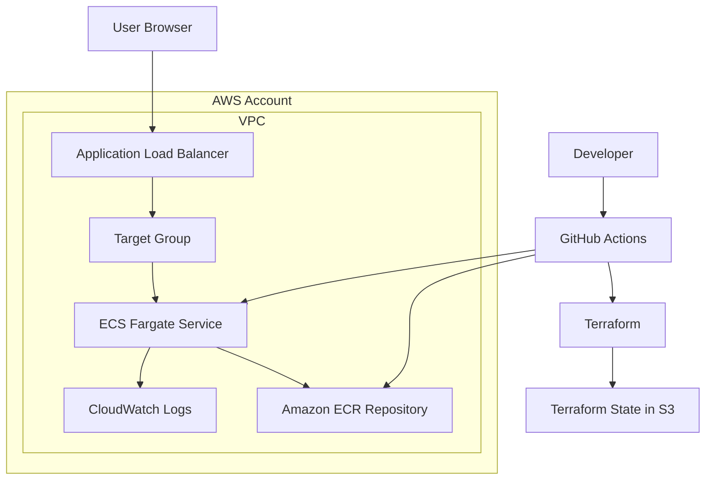

# FastAPI Deployment on AWS ECS Fargate (Terraform + GitHub Actions)

This project demonstrates how to deploy a minimal **FastAPI** backend to **AWS ECS Fargate** behind an **Application Load Balancer (ALB)** using **Terraform** and **GitHub Actions**.

The CI/CD pipeline builds a Docker image, pushes it to **Amazon ECR**, and updates the ECS service automatically.

---

### Available Endpoints
| Method | Path     | Description          |
|--------|----------|----------------------|
| GET    | /        | Hello World response |
| GET    | /health  | Health check         |

---

## 🏗 Architecture

---

## 📁 Folder Structure

.
├── app/                      # FastAPI application
│   ├── main.py
│   ├── requirements.txt
│   ├── Dockerfile
│   └── .dockerignore
│
├── terraform-backend/        # Terraform state backend (S3)
│   └── main.tf
│
├── terraform/                # Main infrastructure
│   ├── backend.tf
│   ├── main.tf
│   ├── variables.tf
│   ├── outputs.tf
│   └── providers.tf
│
└── .github/workflows/        # Manual CI/CD workflow
    └── deploy.yml

---

## 🧰 Tech Stack

- **Fast API (python)**
- **Docker**
- **AWS ECS Fargate**
- **AWS Application Load Balancer**
- **Amazon ECR**
- **CloudWatch Logs**
- **GitHub Actions**

---